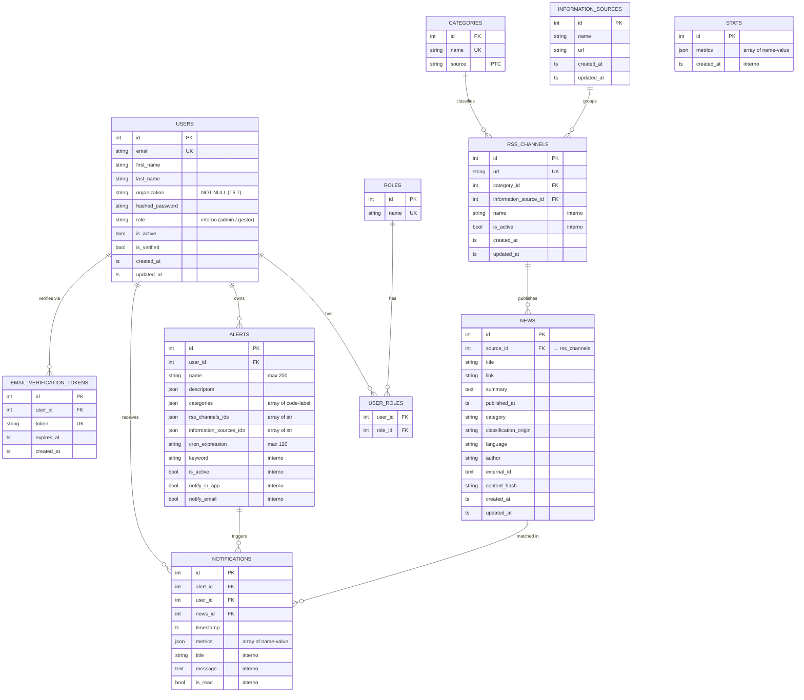

# Diseño de base de datos

> Documento técnico generado en Fase 2 (D3). Refleja el estado tras todas
> las migraciones de Fase 0 + Fase 1.

## Diagrama entidad-relación

## Tablas

### Identidad y permisos

- **`users`** — clave primaria por `id`, email único. `organization` es
  obligatorio (T6.7). Conserva `role` (string) por compatibilidad con
  `require_role()` aunque la API oficial trabaja con `role_ids`.
- **`roles`** — entidad propia (T6.2). Seed: `admin` (id 1), `gestor` (id 2).
- **`user_roles`** — m:n. Permite que un usuario tenga varios roles
  simultáneamente (la API oficial usa `role_ids: List[int]`).
- **`email_verification_tokens`** — tokens de un solo uso, expiran a 24h.

### Catálogo de fuentes

- **`categories`** — IPTC primer nivel (17) + `uncategorized`.
- **`information_sources`** — medio (BBC, El País, Reuters…). Tiene `url`
  derivada del dominio del feed RSS de referencia.
- **`rss_channels`** — feed concreto. FK a `categories` y a
  `information_sources`. `is_active` permite desactivar sin borrar.

### Contenido

- **`news`** — noticias capturadas por el crawler. `source_id` apunta a
  `rss_channels.id` (post-T6.3). Deduplicación con `external_id`, `link`
  y `content_hash`.

### Alertas y notificaciones

- **`alerts`** — alerta de un usuario (`user_id`). Filtros JSONB:
  `descriptors`, `categories`, `rss_channels_ids`, `information_sources_ids`.
- **`notifications`** — UNIQUE `(user_id, alert_id, news_id)` evita duplicar.
  `timestamp` y `metrics` son los campos del schema oficial; los internos
  cubren la UI.

### Métricas

- **`stats`** — snapshots `{metrics: List[Metric]}`. CRUD oficial.

## Migraciones (orden cronológico)

| Revisión | Tarea | Resumen |
|---|---|---|
| `c1f96429ba06` | inicial | Crea `users`, `sources` (legacy) |
| `9fb7e775ba22` | inicial | Setup |
| `567e56f08b73` | Sprint 0 | Crea `alerts`, `notifications` |
| `cd786bdde698` | Sprint 0 | `created_at`/`updated_at` en sources |
| `7515cb2144f0` | Sprint 4 | Crea `news` |
| `e9b068e3a326` | Sprint 4 | Campos extra alerts |
| `c0ef8833917d` | Sprint 4 | ON DELETE CASCADE en news.source_id |
| `a1b2c3d4e5f6` | Sprint 1 | Email verification tokens + roles previo |
| `b2c3d4e5f6a7` | Sprint 3 | source_ids en alerts + category en sources |
| `d4e5f6a7b8c9` | Sprint 4 | classification_origin en news |
| `e5f6a7b8c9d0` | Sprint 2 | medium_name en sources + backfill |
| `f6a7b8c9d0e1` | Sprint 4 | external_id text largo |
| `e623709a0305` | Sprint 5 | FKs notifications |
| `efcce35ef89a` | Fix | cron_expression en alerts |
| **`f1a2b3c4d5e6`** | Phase 0 | Roles entity + remove lector |
| **`f2b3c4d5e6f7`** | Phase 1 (T6.3) | Split sources → categories + information_sources + rss_channels |
| **`f3c4d5e6f7a8`** | Phase 1 (T6.4) | Align alerts con API oficial |
| **`f4d5e6f7a8b9`** | Phase 1 (T6.5) | Notifications: timestamp + metrics |
| **`f5e6f7a8b9c0`** | Phase 1 (T6.6) | Crear stats |
| **`f6f7a8b9c0d1`** | Phase 1 (T6.7) | organization NOT NULL + tamaños 120/180 |

Ejecutar con `alembic upgrade head` (lo hace automáticamente el `command:`
del service `api` en docker-compose).

## Convenciones SQL

- **Índices**: PK, FKs y campos de búsqueda frecuente (email, url, name).
- **Eliminación**: `ON DELETE CASCADE` en relaciones donde la entidad hija
  no tiene sentido sin la padre (notifications/news cuando borras user).
  En `rss_channels.category_id` usamos `RESTRICT` para evitar borrar una
  categoría que está siendo usada.
- **Backfill en migraciones**: cuando una columna se vuelve NOT NULL, la
  migración rellena valores por defecto antes de imponer la constraint
  (ver `f6f7a8b9c0d1`: `organization='Unknown'` para registros previos).
- **JSONB sobre Postgres**: usado para arrays heterogéneos (descriptors,
  categories, metrics, rss_channels_ids) en vez de tablas normalizadas
  para encajar con el contrato oficial.
