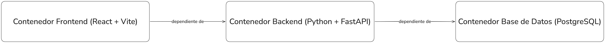

# Sistema de despliegue para NEWSRADAR

## Introducción

Para llevar a cabo el despliegue de NEWSRADAR, se utilizan contenedores Docker orquestados mediante Docker Compose al igual que en el entorno de desarrollo como se menciona en su respectivo ADR en el archivo ```development_env.md```. 

De cara al setup de producción, se decide seguir utilizando Docker y Docker Compose en base a los siguientes factores: 
- Aislamiento de las distintas partes del sistema, ya que:
    - Se evitan conflictos de dependencias o configuraciones.
    - Se aislan los fallos de cada parte del sistema.
    - Se permiten cambios modulares en las distintas partes del sistema, por ejemplo, poder en un futuro añadir una base de datos nueva o cambiar la que se está usando por otra (Migrar de PostgreSQL a MariaDB o alguna otra base de datos).
    - Se permite el escalado independiente de cada parte del sistema en caso de que sea necesario en el futuro.

- Portabilidad, pues el sistema se podrá desplegar de forma parecida tanto en entornos locales como en la nube sin necesidad de realizar grandes cambios en la configuración.

- Docker Compose en concreto es un sistema de orquestación de contendores Docker que simplifica y automatiza gran parte del despligue, pues permite describir el despliegue entero en un único archivo ```docker-compose.yaml``` y manejar distintas dependencias físicas entre los servicios que se definan como un orden específico de inicio y apagado. Así mismo, Docker Compose también maneja las dependencias de red internas del sistema.

## Descripción del despliegue 

Se despliega el sistema de la siguiente forma para de esta forma aprovechar los factores que se han mencionado anteriormente:

### 1. Contenedor Backend

Responsabilidades:
- Exponer API REST
- Manejar la autenticación de usuarios mediante JWT
- Manejar la lógica de negocio
- Ejecutar Crawler RSS y Scheduler

Justificación:
- Centralizar lógica de backend
- Aislar desarrollo de Python + configuración de FastAPI
- Permitir escalado independiente en casos futuros

---

### 2. Contenedor Base de Datos

Responsabilidades:
- Persistencia de los datos del sistema.
- Manejar la base de datos relacional del sistema.

Justificación: 
- Separación estricta entre la lógica del sistema y la persistencia de datos
- Se asegura la persistencia de datos mediante **volúmenes de Docker**
- Se permiten posibles reemplazos a la base de datos

---

### 3. Contenedor Frontend

Responsabilidades:
- Mostrar la interfaz de usuario
- Mandar peticiones de la API y consumir sus respuestas

Justificación:
- Se desacopla el frontend del backend del sistema
- Permite el desarrollo y testing independiente del frontend
- Soporta despliegue futuro del frontend como assets estáticos, es decir, compilar el proyecto del frontend para obtener archivos mínimos de javascript, html y css que no tengan dependencias externas

---

### 4. Orden de inicio entre contenedores

Además de dividir el despliegue de nuestro sistema en 3 contenedores, se ha impuesto también un orden de inicio para estos contenedores de acuerdo a las dependencias físicas que existen entre cada contenedor, esto se hace por ejemplo para evitar el inicio de un frontend sin tener un backend ejecutándose en su respectivo contenedor.

Las dependencias físicas entre contenedores de nuestro sistema se pueden ver en la siguiente imagen:



Esto se consigue implementar en nuestro despliegue mediante el uso de `healthchecks` y del manejo de dependencias de Docker Compose. 

Siendo los `healthchecks` esencialmente un comando que se puede programar para que se ejecute con una determinada periocidad, en nuestro caso cada 5 segundos, y cuyo objetivo es determinar que el código o programa adecuado se está ejecutando dentro de su contenedor.

Gracias a estos checkeos de salud de Docker Compose se pueden implementar también el manejo de dependencias de los contenedores en base a una condición determinada, que usualmente será `service_healthy`. 

Usando estas herramientas, implementamos las dependencias de la siguiente manera:
- El contenedor del Backend es dependiente del contenedor de la Base de Datos en base a la condición `service_healthy` y por lo tanto hasta que el `healthcheck` del contenedor de la Base de Datos no resulte satisfactorio no se iniciará el contenedor del Backend.
- El contenedor del Frontend es dependiente del contenedor del Backend y del contenedor de la Base de Datos, ambos con la condición `service_healthy`.

## Uso del despliegue en entorno de desarrollo

### Iniciando el entorno

Para iniciar el entorno de desarrollo basta con tener instalado en el sistema local **Docker** y **Docker Compose** y ejecutar los siguientes comandos: 

- **NOTA**: el primer comando solo se tendría que ejecutar la primera vez o cada vez que se haga algún cambio al entorno de uno de los contenedores específicos, esto incluye instalar nuevos paquetes mediante pip o npm para el **backend** o **frontend** respectivamente.

- **IMPORTANTE**: Ejecutar desde el directorio raíz del proyecto, ya que es donde se encuentra el archivo principal de este despliegue ``` docker-compose.yaml ```

```
docker compose build
docker compose up
```

Esto iniciará: 
- Contenedor Backend que ejecuta el código de nuestra API en FastAPI y Python a través del puerto 8000, se ejecuta en **modo de desarrollo**.
- Base de datos PostgreSQL que se ejecuta en el puerto 5432, el usuario y contraseña a la base de datos están definidas en el archivo ``` docker-compose.yaml ``` por el momento al ser un **entorno de desarrollo**.
- Contenedor Frontend que ejecuta nuestra UI en React + Vite en el puerto 5173, se ejecuta en **modo de desarrollo**.

### Manejando el entorno de desarrollo

----

Los siguientes comandos pueden servir para manejar de forma más avanzada el entorno de desarrollo: 
- ```docker compose stop```: Parar de ejecutar el entorno de desarrollo.
- ```docker compose rm```: Eliminar los contenedores del entorno de desarrollo, tiene que estar parado.
- ```docker ps```: Lista los contenedores Docker que se están ejecutando en la máquina y su estado.
- ```docker compose up -d```: Iniciar el entorno de desarrollo en modo **detached**, de esta forma no aparecerán los logs del sistema en pantalla
- ```docker compose logs -f```: Ver los logs del entorno de desarrollo, la flag ```-f``` sirve para poder ver las actualizaciones de los logs en tiempo real.
- ```docker compose down -v```: Borrará los contenedores y volúmenes del entorno de desarrollo, **Esto borrará la base de datos que se haya construido localmente en el sistema**.

