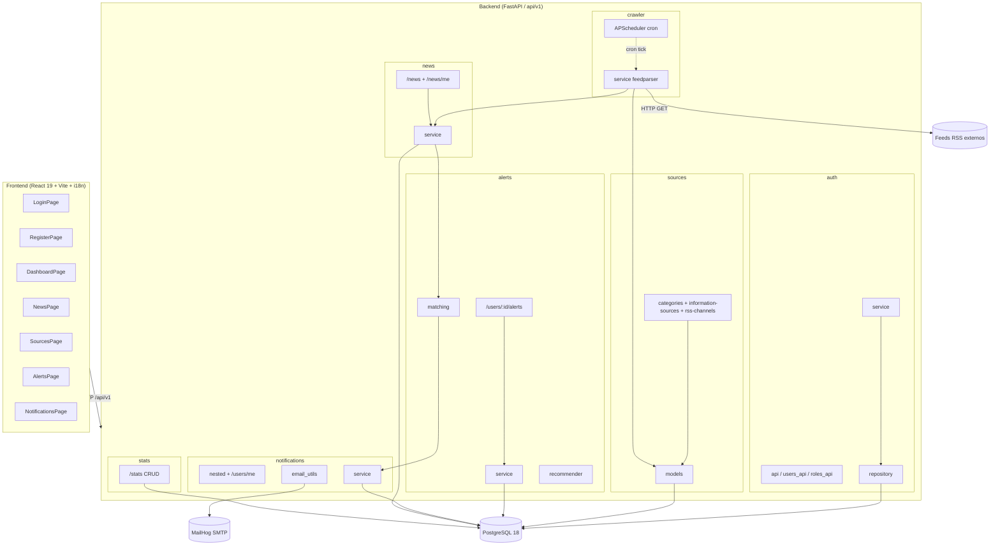

# Diagrama de bloques de arquitectura

Capas y módulos del sistema NEWSRADAR. GitHub renderiza el código Mermaid
automáticamente; para regenerarlo a PNG basta con `mmdc -i architecture.md`.

## Lectura rápida

- **Frontend** habla solo con el backend bajo `/api/v1`.
- **Auth** mantiene `users`, `roles` y email verification tokens.
- **Sources** se ha desdoblado en `Category`, `InformationSource` y `RSSChannel`
  para alinear con la API oficial.
- **Crawler** + **APScheduler** ejecutan un ciclo cron (`*/5 * * * *` por defecto)
  que parsea feeds, crea `News` y dispara el motor de matching.
- **Matching** filtra por descriptors/categories/canales/medios de cada alerta y
  produce notificaciones in-app + emails para el propietario de la alerta
  (CAMBIO #2 oficial: dashboards y notificaciones son per-usuario).
- **Notifications** expone los endpoints anidados oficiales más atajos
  `/users/me/notifications` para la UI.
- **Stats** sigue el contrato oficial (snapshots `{metrics: List[Metric]}`).

> Nota Mermaid: las URL con parámetros se escriben con `:id` en lugar de `{id}`
> porque las llaves chocan con la gramática del parser de GitHub. Conceptualmente
> son los mismos paths anidados oficiales (`/users/{id}/alerts`).
