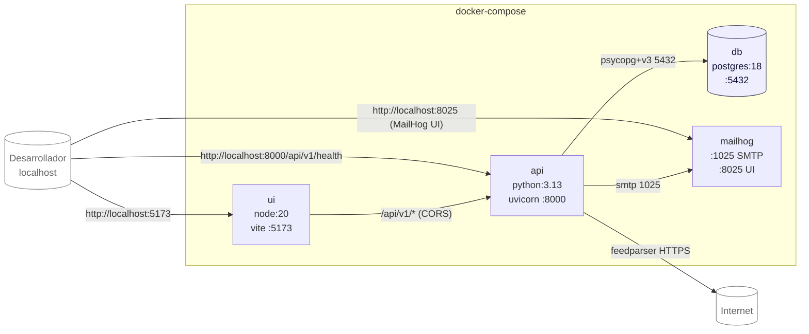

# Diagrama de despliegue (arquitectura física)

Servicios definidos en `docker-compose.yaml`. Cada bloque es un contenedor
Docker; las flechas indican comunicación de red entre ellos.

## Salud y arranque

- `api` espera al healthcheck de `db` (`pg_isready`).
- En el `lifespan` arranca:
  1. `_seed_admin_user()` → crea el admin si no existe (checklist #21).
  2. `_seed_rss_sources()` → siembra ~110 canales (checklist #13-15).
  3. `CrawlerScheduler.start()` con la cron expression configurada.
- El healthcheck de `api` apunta a `GET /api/v1/health` (checklist #28).

## Volúmenes

- `postgres_data` — persistencia de la BD entre reinicios. Se borra con
  `docker compose down -v` (necesario tras cambios destructivos en migraciones).
- `frontend_node_modules` — cache de `node_modules` para acelerar cold start.
