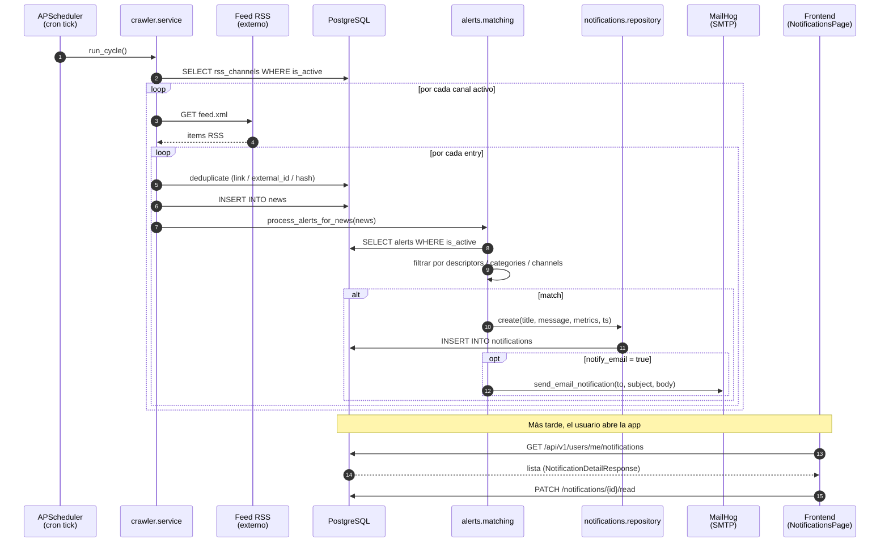

# Diagrama de secuencia — RSS → notificación

Flujo completo desde el tick del scheduler hasta que el usuario ve la
notificación en la bandeja de entrada y/o recibe el email.

## Reglas clave

- **Atomicidad** (duda 21-abr): captura → análisis → guardado en un solo
  proceso. Si una entry falla, las anteriores ya fueron commiteadas y el
  ciclo continúa con la siguiente.
- **Per-usuario** (CAMBIO #2): cada notificación se asocia al `owner` de la
  alerta. Otros usuarios no la ven aunque la news sea la misma.
- **Deduplicación**: la unique constraint `uq_notification_user_alert_news`
  evita duplicar emails/inbox cuando una news pasa varias veces el matching.
